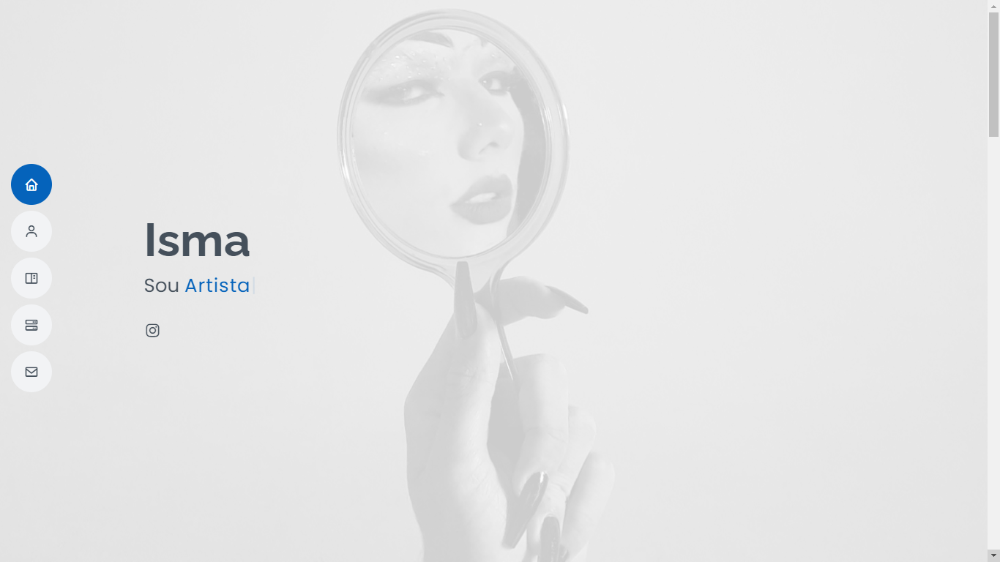
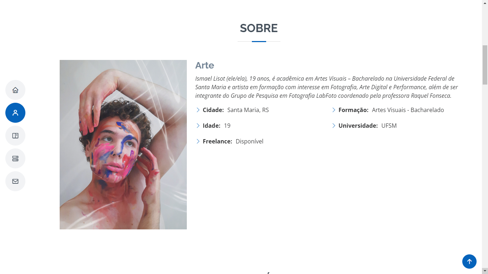
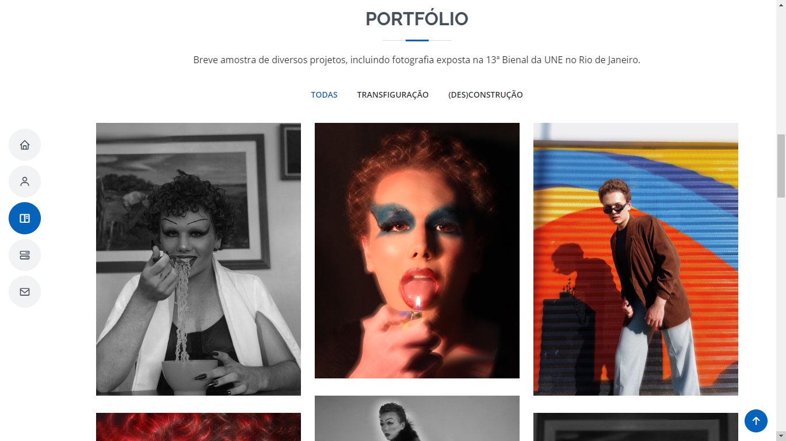

# Portfolio Artístico - Isma

.
.
.

Acesso: Preencha aqui a URL para acesso ao site publicado

#### Desenvolvedor(a)
Roberto José Mahl - roberto.mahl@acad.ufsm.br

#### Cliente
Luana Ferreira Oliveira por Ismael Lisot - luana.oliveira@acad.ufsm.br

#### Tecnologias
- HTML
- CSS
- Javascript
- TODO

#### Ambiente de desenvolvimento
- VS Code
- Google Chrome
- Github

#### Créditos
- Template de BootstrapMade.com: https://bootstrapmade.com/free-html-bootstrap-template-my-resume/
- TODO

#### Bastidores
Inicialmente, houve certa dificuldade na definição de um objetivo para o serviço prestado à minha cliente. Havia interesse, de ambas as partes, na produção de um portfólio, mas o conteúdo que tínhamos a apresentar não parecia suficientemente atrativo. Sendo assim, optamos por terceirizar o cliente para que obtivéssemos um resultado mais visualmente estimulante. Com isso, Luana passou a ser representante de Ismael Lisot, estudante de Artes Visuais na UFSM e nosso amigo.  
As tecnologias de desenvolvimento foram definidas através da seleção de um template de website. Para isso, observei e validei com minha cliente layout, responsividade, funcionalidades e estruturação de código do template.  
Uma vez definido o template, fui impressionado pela relação entre qualidade e simplicidade do código encontrado. Não tive muitas dificuldades para entender o que estava sendo feito ou localizar snippets de código que cumpriam determinadas funções. Foi fácil, por exemplo, mapear o código que poderia ser descartado dos arquivos HTML, CSS ou Javascript ao remover uma seção da página. Além disso, mesmo com um código simples, considero o resultado muito satisfatório.  
Como mencionado, algumas seções que vieram com o template original acabaram sendo removidas na versão final, por questões de incoerência ou incompatibilidade. Por exemplo, depoimentos de clientes não pareciam combinar com o tipo de página e foram descartados, bem como o formulário de envio de emails, na seção de contato, que não funcionaria. Ademais, tudo que foi idealizado pôde ser desenvolvido.

---
Projeto entregue para a disciplina de [Desenvolvimento de Software para a Web](http://github.com/andreainfufsm/elc1090-2023a) em 2023a
